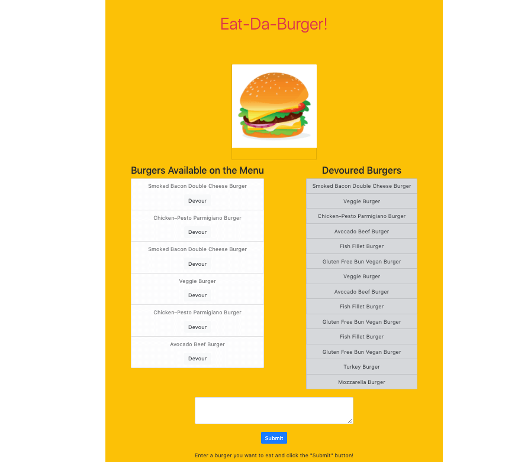

# Assignment 13 – Node Express Handlebars: "Eat-Da-Burger!" Restaurant App

## Description
The following apllication is a simple restaurant app that allows users to add burgers to a list through a form. Once they have submitted their burger, it will be added to the "Burgers Available on the Menu" list. When the user clicks on the "Devour" button for a particular burger, it will be removed from the list added added to the "Devoured Burgers" list. The application is deployed on Heroku, and uses Node, Express, and Handlebars to generate the html, styling, and functionality of the page.

## Usage
### User Story

```
AS A user who is a hungry burger aficionado
I WANT to make a list of burgers I want to eat
SO THAT I that I can sate my hunger

AS A user who has eaten a burger
I WANT to make a list of the burgers I have eaten
SO THAT I can keep track of the burgers I have and have not yet tried
```

### Acceptance Criteria

```
GIVEN I am taking a user who is a hungry burger aficionado
WHEN I type in the name of a burger into the form and hit the "Submit" button
THEN the burger is added to the "Burgers Available on the Menu" list
WHEN I click on the "Devour" button for a particular burger
THEN the burger is removed from the list and added to the "Devoured Burgers" list
```

## Application Screenshot



## Accesories and Technologies Used:
### Languages
* HTML
* CSS
* [Bootstrap](https://getbootstrap.com/)
* [jQuery](https://jquery.com/)

### Programs and Applications
* [Visual Studio Code](https://code.visualstudio.com/)
* [Google Chrome](http://www.google.com/chrome)
* [MYSQL](https://www.mysql.com/) (Databases)
* [Node.js](https://nodejs.org/en/)
* [Handlebars](https://handlebarsjs.com/)
* Git/Terminal
* [Zoom](http://www.zoom.us/)
* [Slack](https://slack.com/intl/en-ca/)
* [JawsDB](https://devcenter.heroku.com/articles/jawsdb)

### Libraries
* [Express](https://expressjs.com/)
* [Handlebars](https://handlebarsjs.com/)

### Websites
* [GitHub](https://github.com/)
* [Heroku](https://www.heroku.com/)
* [W3Schools](https://www.w3schools.com/)
* [Stack Overflow](https://stackoverflow.com/)

## Deployed Links
* GitHub Repository URL: https://github.com/MG-cpu90/assignment13
* Deployed URL: https://whispering-sands-43076.herokuapp.com/